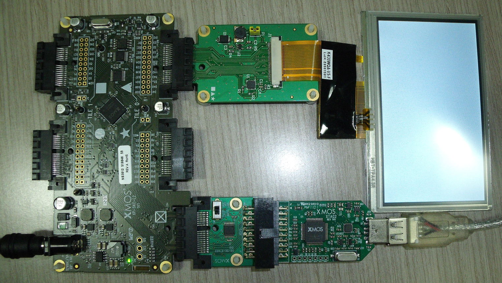

Touch Controller Simple Demo Quickstart Guide
=============================================

.. _Slicekit_TouchController_Simple_Demo_Quickstart:

This demo uses the XA-SK-SCR480 Slice Card together with the Kentec K430WQA-V5-F display.  xSOFTip I2C Master component is used to communicate with the AD7879-1 low voltage controller chip on the slice card for interfacing the touch screen of the 
Kentec display. 

The demo consists of simple functions to read the touch coordinates and also to compute the delay in touch.

  
Hardware Setup
++++++++++++++

The XP-SKC-L2 Slicekit Core board has four slots: ``SQUARE``, ``CIRCLE``, ``TRIANGLE`` and ``STAR``. 

To setup up the system:

   #. Connect the XA-SK-SCR480 Slice Card to the ``TRIANGLE`` slot (Tile 0) of XP-SKC-L2 Slicekit Core board.
   #. Connect the Kentec K430WQA-V5-F display to the connector on the slice card.
   #. Connect the XTAG Adapter to Slicekit Core board, and connect XTAG-2 to the adapter. 
   #. Connect the XTAG-2 to host PC. Note that a USB cable is not provided with the Slicekit starter kit.
   #. Switch on the power supply to the Slicekit Core board.

   Hardware Setup for Touch Controller Demo
   
	
Import and Build the Application
++++++++++++++++++++++++++++++++

   #. Open xTIMEcomposer Studio.
   #. Import ``sc_lcd`` project and ``module_i2c_master`` module into the Project Explorer window of the xTIMEcomposer. 
   #. Click on the ``app_touch_controller_lib_demo`` item in the Explorer pane. Then click on the build icon (hammer) in xTIMEcomposer. Check the console window to verify that the application has built successfully.

 

Run the Application
+++++++++++++++++++

Now that the application has been compiled, the next step is to run it on the Slicekit Core Board using the tools to load the application over JTAG (via the XTAG2 and XTAG Adaptor card) into the xCORE multicore microcontroller.

   #. Click on the run icon (the white arrow in the green circle). A dialog will appear asking which device to connect to. Select ``XMOS XTAG2``. 
   #. Wait for the message ``Please touch the screen .....`` in the Debug Console window. When the screen is touched, the touch coordinates are displayed.
   #. Wait for another message. When the screen is touched again, the touch coordinates along with the delay in touch are displayed. If there is no touch for a period of time (``TIME_OUT`` currently set to 10 seconds in ``touch_controller_conf.h``), a message ``No touch for more than 10 seconds`` is printed and the program continues to wait for a touch.

    
Next Steps
++++++++++

Look at the Code
................

   #. Examine the application code. In xTIMEcomposer, navigate to the ``src`` directory under ``app_touch_controller_lib_demo`` and double click on the ``app_touch_controller_lib_demo.xc`` file within it. The file will open in the central editor window.
   #. Find the ``main()`` function and note that it runs the ``app()`` function on a single logical core. You may engage other seven logical cores using ``par`` replicator.
   #. The ``app()`` function in the file calls three functions, namely, ``touchscreen_init()``, ``touch_req_next_coord()`` and ``touch_req_next_coord_timed()``. ``touchscreen_init()`` initialises the touch screen controller AD7879-1. It should be called before calling any of the other two functions.
   #. The functions ``touch_req_next_coord()`` and ``touch_req_next_coord_timed()`` wait for the touch and read the touch coordinates stored in the result registers of AD7879-1.  ``touch_req_next_coord_timed()`` computes the delay in touch as well.
   #. The various parameters used are defined in ``touch_controller_conf.h``. You can change their values if necessary.
   

Try the Server-based Touch Controller Demo
..........................................

   #. The server-based demo ``app_touch_controller_server_demo`` has a touch controller server running on a separate logical core. Follow the quickstart guide for this application for further information on running this demo.
   