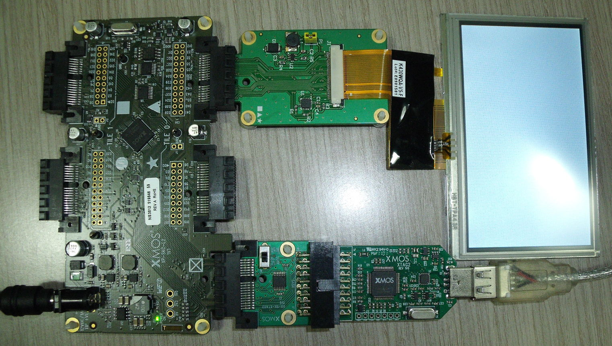

Touch Controller - Server Demo Quick start Guide
================================================

.. _Slicekit_TouchController_Server_Demo_Quickstart:

This demo uses Slicekit Starter Kit, XA-SK-SCR480 Slice Card and Kentec K430WQA-V5-F Display module.  xSOFTip I2C Master component is used to communicate with the AD7879-1 low voltage controller chip on the slice card to interface with the 
Kentec Display/Touchscreen module. 

The demo consists of simple functions to read the touch coordinates.

  
Hardware Setup
++++++++++++++

The XP-SKC-L2 Slicekit Core board has four slots: ``SQUARE``, ``CIRCLE``, ``TRIANGLE`` and ``STAR``. 

To setup up the system:

   #. Connect the XA-SK-SCR480 Slice Card to the ``TRIANGLE`` slot (Tile 0) of XP-SKC-L2 Slicekit Core board.
   #. Connect the Kentec K430WQA-V5-F display to the connector on the slice card.
   #. Connect the XTAG Adapter to Slicekit Core board, and connect XTAG-2 to XTAG Adapter. 
   #. Connect the XTAG-2 to host PC. Note that a USB cable is not provided with the Slicekit Starter Kit.
   #. Switch on the power supply to the Slicekit Core board.

   Hardware Setup for Touch Controller Demo
   
 
Import and Build the Application
++++++++++++++++++++++++++++++++

   #. Open xTIMEcomposer Studio.
   #. Import ``sc_lcd`` project and ``module_i2c_master`` module into the Project Explorer window of the xTIMEcomposer. 
   #. Click on the ``app_touch_controller_server_demo`` item in the Explorer pane. Then click on the build icon (hammer) in xTIMEcomposer. Check the console window to verify that the application has been built successfully.

Run the Application
+++++++++++++++++++

Now that the application has been compiled, the next step is to run it on the Slicekit Core Board using the tools to load the application over JTAG (via the XTAG2 and XTAG Adaptor card) into the xCORE multicore microcontroller.

   #. Click on the run icon (the white arrow in the green circle). A dialog will appear asking which device to connect to. Select ``XMOS XTAG2``. 
   #. Wait for the message ``Please touch the screen .....``. When the screen is touched, the touch coordinates are displayed. For subsequent touches, both the present and the previous touch coordinates are displayed. There should be a time gap of at least one second between successive touches. If there is no touch for a period of time (``TOUCH_SERVER_TIME_OUT`` currently set to 10 seconds in ``touch_server_conf.h``), a message ``No activity for 10 seconds`` is printed and the program continues to wait for a touch event. The ``No activity`` message is printed every 10 seconds.
   #. You can terminate the program by clicking on the red button in the Console window.
 
    
Next Step
+++++++++

Look at the Code
................

   #. Examine the application code. In xTIMEcomposer, navigate to the ``src`` directory under ``app_touch_controller_server_demo`` and double click on the ``app_touch_controller_server_demo.xc`` file within it. The file will open in the central editor window.
   #. Find the ``main()`` function and note that it runs the ``app()`` function on one logical core and the ``touch_controller_server()`` on another core. You may engage other six logical cores using ``par`` replicator. To do this, do not comment the line ``par(int i=0;i<6;i++) on stdcore[TILE]: while(1);``.
   #. The ``app()`` function in the file calls two functions, namely, ``touch_server_get_last_coord()`` and ``touch_server_get_next_coord()`` repeatedly. The function ``touch_server_get_last_coord()`` retrieves the already stored touch coordinates from the server. The function  ``touch_server_get_next_coord()`` waits for the touch event and reads the touch coordinates stored in the result registers of AD7879-1.  
   #. The various parameters used are defined in ``touch_server_conf.h``. You can change their values if necessary.